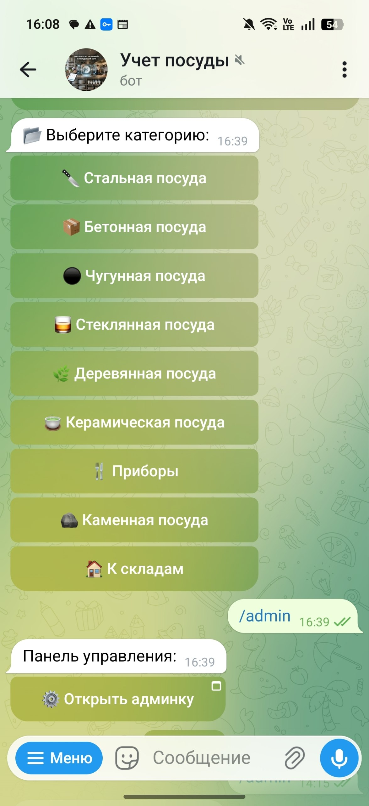
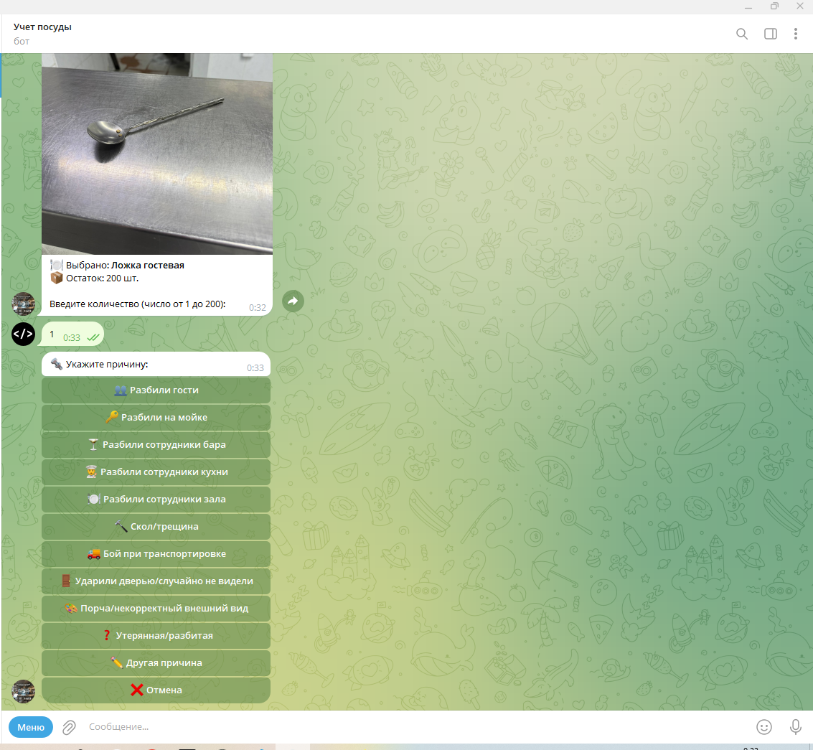
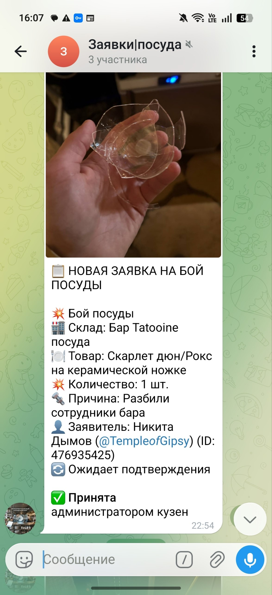
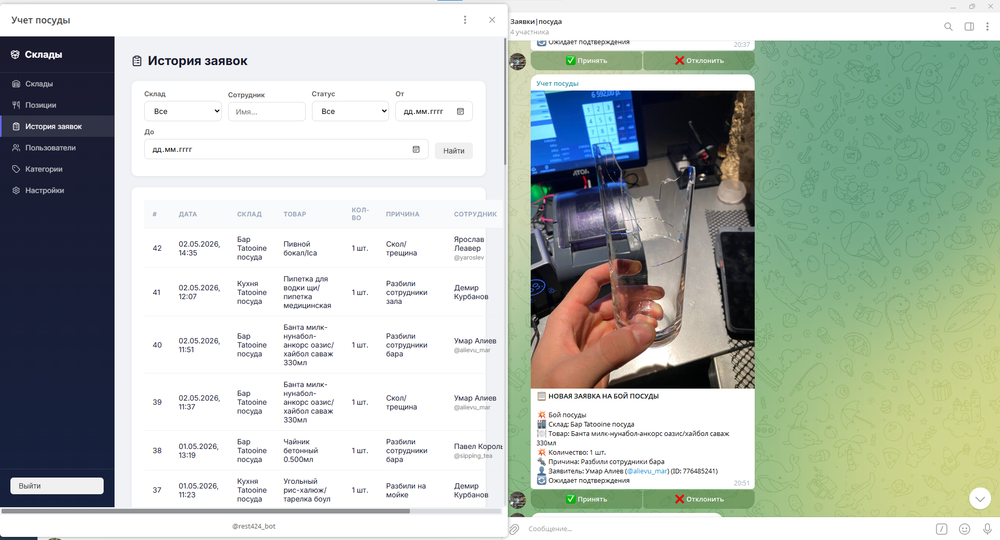

# Restaurant Dish Inventory Bot

Telegram bot and web admin panel for managing restaurant tableware inventory and dish breakage reports.

The system allows restaurant employees to report broken dishes directly from Telegram, while administrators can manage inventory, users, requests, and bot settings through a web admin panel.

## Features

### Telegram Bot

- Employee registration and authorization
- Warehouse selection
- Tableware category browsing
- Item catalog browsing

- Dish breakage reporting
- Quantity input
- Breakage reason selection

- Photo attachment for reports

- Sending breakage requests to an admin Telegram group

### Web Admin Panel



- Warehouse management
- Tableware category management
- Inventory item management
- Breakage request review
- Employee user management
- Bot settings management
- Admin authentication

## System Architecture

```text
Employee (Telegram)
      ↓
Telegram Servers
      ↓
Nginx (port 443, SSL Let's Encrypt)
      ↓
Node.js Application (port 3000)
├── Telegraf Bot
└── Express Admin Panel (/admin)
      ↓
Supabase PostgreSQL + Redis
```

## Tech Stack

| Component | Technology |
|---|---|
| Runtime | Node.js 20 LTS |
| Process Manager | PM2 |
| Telegram Bot | Telegraf 4.x |
| Web Framework | Express 4 |
| Templates | EJS |
| Database | Supabase PostgreSQL |
| Sessions / Cache | Redis |
| Reverse Proxy | Nginx + Let's Encrypt |
| Deployment | GitHub Actions |

## Bot Commands

| Command | Description |
|---|---|
| `/start` | Register a new user or open the catalog |
| `/boy` | Create a dish breakage report |
| `/admin` | Get a link to the web admin panel |

## User Flows

### New User Registration

```text
/start
  ↓
Enter name
  ↓
Enter access password
  ↓
Authorized
```

### Catalog Browsing

```text
/start
  ↓
Select warehouse
  ↓
Select category
  ↓
View item list
  ↓
Open item card
```

### Breakage Report

```text
/boy
  ↓
Select warehouse
  ↓
Select category or search item
  ↓
Select item
  ↓
Enter quantity
  ↓
Select breakage reason
  ↓
Attach photo
  ↓
Confirm report
  ↓
Request is sent to the admin group
```

## Database Structure

Database migrations are stored in the `migrations/` directory.

### Main Tables

| Table | Description |
|---|---|
| `warehouses` | Restaurant warehouses or storage locations |
| `item_categories` | Tableware categories |
| `items` | Inventory catalog items |
| `breakage_requests` | Submitted dish breakage reports |
| `bot_users` | Authorized Telegram users |
| `bot_settings` | Bot configuration values |
| `admin_users` | Web admin panel users |

## Environment Variables

Create a `.env` file based on `.env.example`.

| Variable | Description |
|---|---|
| `BOT_TOKEN` | Telegram bot token from BotFather |
| `ADMIN_CHAT_ID` | Telegram admin group ID |
| `SUPABASE_URL` | Supabase project URL |
| `SUPABASE_KEY` | Supabase service role key |
| `REDIS_URL` | Redis connection URL |
| `SESSION_SECRET` | Secret string for session signing |
| `PORT` | Application port, default is `3000` |
| `NODE_ENV` | Application environment, for example `production` |
| `PHOTO_UPLOAD_USER_ID` | Telegram user ID used for temporary photo upload |

## Installation

### 1. Clone the repository

```bash
git clone git@github.com:username/restaurant-dish-inventory-bot.git
cd restaurant-dish-inventory-bot
```

### 2. Install dependencies

```bash
npm install
```

### 3. Configure environment variables

```bash
cp .env.example .env
nano .env
```

Fill in all required environment variables.

### 4. Apply database migrations

```bash
psql $DATABASE_URL < migrations/001_init.sql
psql $DATABASE_URL < migrations/002_categories.sql
```

### 5. Start the application

```bash
npm start
```

## Production Deployment

The application is designed to run on a VPS server with:

- Nginx as a reverse proxy
- HTTPS via Let's Encrypt
- Node.js application running on port `3000`
- PM2 for process management
- Supabase PostgreSQL as the main database
- Redis for sessions and caching

### Start with PM2

```bash
pm2 start ecosystem.config.js
```

### Save PM2 configuration

```bash
pm2 save
```

### Enable PM2 startup on server reboot

```bash
pm2 startup
```

## Deployment Steps

```bash
git clone git@github.com:username/restaurant-dish-inventory-bot.git
cd restaurant-dish-inventory-bot

bash scripts/install.sh

cp .env.example .env
nano .env

psql $DATABASE_URL < migrations/001_init.sql
psql $DATABASE_URL < migrations/002_categories.sql

pm2 start ecosystem.config.js
pm2 save
pm2 startup
```

## Repository Name

Recommended repository name:

```text
restaurant-dish-inventory-bot
```

## Repository Description

```text
Telegram bot and web admin panel for restaurant tableware inventory and breakage management.
```

## License

This project is private and intended for internal restaurant use.
